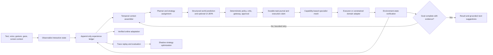

# Heliox OS Architecture

This document describes the implemented v0.10.1 runtime. It is an architecture
contract, not a roadmap. Exact action values live in
`daemon/pilot/actions.py`; exact RPC handlers live in
`daemon/pilot/server.py`.

## System boundaries

Heliox is split into three trust boundaries:

1. **Tauri desktop shell and Svelte UI** collect explicit text, voice, gesture,
   gaze, camera, and settings input. The UI is not the execution authority.
2. **Python daemon** plans, predicts, authorizes, executes, verifies, records,
   and learns from tasks. It binds to localhost and communicates with the UI by
   authenticated WebSocket RPC.
3. **Constrained child runtimes** execute reviewed native and WebAssembly
   plugins. Evolution candidates run in detached Git worktrees inside a
   prebuilt, network-disabled Docker image.

Raw camera frames, audio, hand or face landmarks, screen pixels, and binary
payloads are excluded from the experience and learning stores by default.

## End-to-end task flow

Typed commands and voice commands enter this same path. Long-running browser
and desktop goals may repeat the observation, planning, execution, and
verification segment for at most six rounds per step. The loop stops on
verified completion, a repeated no-progress plan, a denied safety gate,
cancellation, or the round limit.

The ordinary action path is sequential. Parallel branches are allowed only
when a caller explicitly attests that they are independent; fan-out,
delegation depth, cancellation, and resource budgets remain bounded.

## Intelligence and reliability layers

### 1. Unified experience ledger

`pilot.intelligence.experience` records typed, schema-versioned, append-only
events for observations, intents, plans, predictions, approvals, actions,
verification, corrections, suggestions, learning, and terminal outcomes.
Events carry session, task, user, causal-parent, provenance, confidence, and
privacy metadata. Action idempotency keys prevent a retry from becoming a
second training event or a second side effect.

### 2. Trace replay and evaluation

The evaluation harness exports portable traces and replays them without calling
a model or touching the operating system. It grades actual outcome, safety,
latency, efficiency, and interaction quality. Environment probes and required
state assertions prevent a successful-looking chat response from passing when
the machine state is wrong.

### 3. Durable agent loop

The SQLite task journal persists queued, planning, approval, execution,
verification, interrupted, partial, cancelled, failed, superseded, and
succeeded states. Hashed resume capabilities, durable approvals, optimistic
versions, and per-action execution claims support reconnect and restart
recovery. An interrupted or expired claim is marked uncertain and reconciled;
it is never silently repeated.

### 4. Temporal context and memory

Memory is separated into working, episodic, semantic, and time-bounded fact
layers. Facts retain evidence, provenance, confidence, validity windows,
contradiction history, and retraction state. The context assembler ranks
eligible items by relevance, recency, confidence, provenance, scope utility,
and outcome utility under a strict token budget.

A new chat receives the durable user model and relevant memories, not an
unbounded transcript dump. Memory is advisory: it cannot grant permission or
substitute for current-state observation.

### 5. Companion and interruption coordination

One priority coordinator owns narration, risk warnings, approval speech,
failures, final answers, proactive suggestions, voice replies, and user
barge-in. Only one voice speaks at once. Higher-priority speech preempts lower
priority speech, duplicates are suppressed, and user speech takes ownership of
the channel while the person is talking.

The daemon coordinator covers autonomous completion, cognitive warnings,
continuous voice, and frontend speech RPCs. Browser speech synthesis is a
fallback, not a second narrator.

`pilot.system.interaction.InteractionRuntime` exposes one state machine for
text and voice: idle, listening, understanding, planning, awaiting approval,
acting, verifying, correcting, speaking, and terminal states. Voice uses the
same `execute` handler as typed input rather than a second planner/executor
implementation. Barge-in stops current speech; speech received while a task is
active becomes an out-of-band correction that cancels the current step and
replans without repeating already verified actions.

Continuous conversation is explicit and bounded. While the listener is on,
complete utterances are eligible for routing without a wake phrase, and a
30-second follow-up window opens after speech completes. The listener is
suppressed while Heliox itself speaks so TTS cannot become a new command.

### 6. Hybrid world model

The world-model contract predicts a candidate action's expected state, effects,
uncertainty, evidence, sources, and model version. It combines:

- deterministic policy;
- structured OS, filesystem, process, package, service, browser, and UI
  transition prediction;
- calibrated learned disk/process impact and verified historical failure risk;
- an optional action-conditioned UI-JEPA embedding predictor.

The optional JEPA path stays unavailable when validated weights are not staged
and remains shadow-only unless its artifact records gating validation. Learned
evidence may interrupt or add confirmation but can never remove a deterministic
warning or grant authority.

The camera temporal verifier follows the same rule: MediaPipe must first prove
a hand exists; temporal evidence can only reduce or reject a candidate gesture.

### 7. Verified continuous learning

The River-based online learner consumes only newly inserted ledger events. It
learns suggestion relevance from explicit feedback, transition reliability
from callback-observed non-dry-run outcomes, and coarse routines from
privacy-preserving application/time features. Repeated evidence is required
before promotion.

Bounded replay and ADWIN drift detection decay obsolete behavior. Resetting the
learner creates a checkpoint without rewriting the immutable audit ledger.
Learning can rank suggestions and context, but cannot execute actions, browse
for training data, or weaken policy.

### 8. Strategy evolution

GEPA-style reflection proposes bounded planner, tool-description, recovery,
context, suggestion, and decomposition candidates. Candidates are inert while
they move through isolated replay, safety and regression evaluation, shadow
mode, consented canary, and exact-ID administrator promotion.

At least three matching replay scenarios, 10 non-regressing shadow samples,
five non-regressing canary samples, and zero safety incidents are required.
Automatic promotion is disabled, and rollback restores the prior assignment or
the shipped baseline.

### 9. Capability and plugin security

Marketplace manifests declare exact filesystem roots, network domains,
processes, credentials, clipboard directions, devices, retention, and
destructive authority. Catalog hashes, Ed25519 package signatures, manifest
validation, and installed-manifest equality are prerequisites.

Native Python plugins run in one-shot constrained child processes with a
scrubbed environment and only declared credentials. WebAssembly plugins receive
path-scoped WASI preopens, explicit environment grants, bounded memory and
runtime, and no network by default. Native `plugin_call` and reviewed
`wasm_call` remain distinct execution paths. Destructive plugin tools can run only
through the guarded planner and approval path.

### 10. Evolutionary engineering harness

The improvement harness generates multiple inert patch candidates from a
recorded base commit. Candidates are applied only in detached worktrees and
evaluated in the reviewed `heliox-evolution-runner:0.10.0` image with networking
disabled, a read-only root filesystem, dropped Linux capabilities,
`no-new-privileges`, bounded CPU/memory/PIDs, and no inherited credentials.

There is no host-process fallback or automatic image pull. The harness cannot
modify the installed application, push, release, access release credentials, or
promote code. An exact candidate ID creates evidence for external human review.

### 11. Specialist agent mesh

The daemon registers 21 concrete specialists across 20 gateway roles:

| Domain | Specialists |
|--------|-------------|
| OS and desktop | System, File Operations, Package Management, Service Management, Desktop Automation |
| Development and automation | Code, Git, Workflow Automation |
| Web and integration | Web, Network, Integration, Plugin Runtime |
| Communication | Communication, Email, Calendar, RSS |
| Perception and retrieval | Vision, Monitor, Forensics, Semantic Search |
| Remote systems | SSH |

Communication and Email intentionally share the `comm_agent` gateway identity
but retain distinct provider identities. Provider selection uses exact
capability contracts and callback-observed success and latency with a Bayesian
prior. Narrower scope breaks a quality tie; self-reported quality does not.

Every specialist has action, confirmation, gateway, resource, token, action,
latency, and concurrency contracts. Delegation has maximum depth 3 and fan-out
4, rejects cycles, shares cancellation, and carries bounded context references
and partial results.

The mesh exposes approved plugin tools as guarded external providers for
diagnostics, but does not execute plugin code directly. Plugin calls remain
behind the capability broker and planner approval path.

## Action execution and coverage

`ActionType` declares 156 actions. Startup builds the provider index and the
`agent_mesh_status` RPC reports registered actions, available actions, coverage,
and exact uncovered names. The current contract is 156/156 with zero uncovered
routes.

Most specialists filter a sub-plan and use the shared `Executor`, preserving
validation, Agent Gateway policy, learned-risk checks, audit, approval,
idempotency, cancellation, and verification. Calendar, Email, and SSH use
dedicated adapters with hard domain restrictions. A declared
`AgentCapability` describes routing and resource scope; it is not by itself an
operating-system sandbox.

### Adaptive browser and desktop execution

`AutonomousExecutor` and durable voice/gesture workflows share a bounded
observe → act → verify loop for interactive applications. Each round refreshes
screen context, asks the planner for only the next grounded action or tightly
coupled pair, executes through the normal security path, and verifies the real
environment before continuing. An empty plan is successful only when it
contains an explicit completion claim backed by fresh evidence; exact-text
goals are checked case-sensitively.

UI coordinates must come from a current element-detection result. A placeholder
`(0, 0)` click is resolved through `screen_detect_elements`; a missing or
ambiguous target fails instead of guessing. Three repeats of the same plan and
screen fingerprint stop the loop as no progress.

Native application control carries a target-window identity across rounds.
Before foreground mouse or keyboard input, Heliox re-acquires that window;
background text entry includes `KeyboardParams.window_title` and fails if the
target cannot be focused or its editable text cannot be verified. Application
launch is platform-specific and fail-closed: Windows resolves Start-menu,
App-Paths, PATH, and registered apps; macOS uses Launch Services through
`open -a`; Linux accepts a PATH executable or a verified `gtk-launch` desktop
entry. No launcher reports success merely because a shell command was issued.

## Security decision order

An action is allowed to reach a side-effect adapter only after the applicable
checks:

1. schema and parameter validation;
2. deterministic permission tier and irreversible-action classification;
3. world-model and destructive-critic caution;
4. source-scoped Agent Gateway floor and deny list;
5. explicit user approval when required;
6. snapshot fail-closed check when required;
7. durable execution claim;
8. adapter-level allowlists or plugin capabilities;
9. post-action environment verification and audit.

Per-task scope overrides can only narrow a shipped gateway profile. No learned
model, memory, plugin, strategy candidate, or specialist may widen authority.

## Persistent state

All state is local unless the user explicitly configures an external service:

| State | Purpose |
|-------|---------|
| Experience ledger | Immutable causal intelligence events |
| Task journal | Durable lifecycle, approvals, and action claims |
| Temporal memory | Evidence-backed working, episodic, semantic, and temporal facts |
| Agent mesh database | Verified provider outcomes and routing quality |
| Local chat sessions | Per-chat transcript and active-task metadata in frontend local storage |
| Online learning state | Replay buffer, drift state, and promoted adaptation |
| Strategy archive | Inert candidates, evaluations, assignments, and rollback |
| Evolution archive/worktrees | Isolated engineering candidates and evidence |
| Permission and gateway audit stores | Independent tamper-evident decision chains |

API keys live in the operating-system credential store, not in these databases.

## Extension invariants

An agent, action, plugin, model, or strategy is incomplete until it has:

- a validated schema and explicit authority contract;
- a concrete provider or constrained runtime;
- cancellation and terminal-result behavior;
- ledger and audit coverage;
- outcome-based verification;
- replay and negative-path tests;
- user-visible status that reports unavailable or fallback states honestly.

See [SECURITY.md](../SECURITY.md), [IPC_MESSAGE_FORMATS.md](../IPC_MESSAGE_FORMATS.md),
[AGENT_DEVELOPMENT_GUIDE.md](../AGENT_DEVELOPMENT_GUIDE.md), and
[PLUGIN_MARKETPLACE.md](PLUGIN_MARKETPLACE.md) for the detailed contracts.
